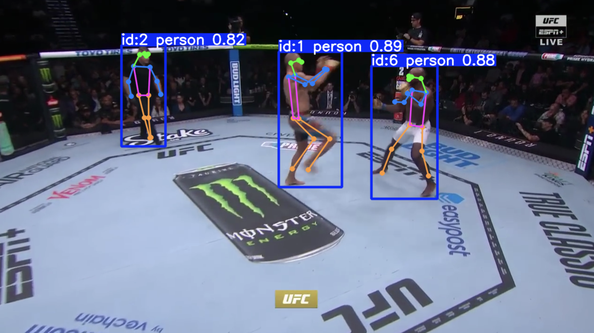

# UFC Fight Analyzer

## Current State


## Table of Contents

- [Introduction](#introduction)
- [Features](#features)
- [Installation](#installation)
- [Usage](#usage)
- [Project Structure](#project-structure)
- [Contributing](#contributing)
- [License](#license)
- [Acknowledgements](#acknowledgements)

## Introduction

**UFC Fight Analyzer** is an open-source project designed to analyze UFC fight videos using advanced computer vision techniques. Leveraging the power of [Ultralytics YOLO](https://github.com/ultralytics/ultralytics) models and tracking algorithms like [ByteTrack](https://github.com/ifzhang/ByteTrack), this tool performs object detection, tracking, and pose estimation to provide insightful analysis of fighters' movements and strategies.

Whether you're a data scientist, sports analyst, or an enthusiast looking to dive deep into fight analytics, UFC Fight Analyzer offers a robust framework to extract and visualize meaningful data from fight footage.

## Features

- **Object Detection & Tracking:** Identifies and tracks fighters throughout the match using state-of-the-art YOLO models and tracking algorithms.
- **Pose Estimation:** Detects keypoints on fighters' bodies to analyze their movements, stances, and techniques.
- **Real-Time Visualization:** Provides real-time visualization of bounding boxes, keypoints, and skeletons on the video frames.
- **Configurable Parameters:** Easily adjust detection confidence thresholds, IOU thresholds, and choose between different tracking algorithms.
- **GPU Acceleration:** Supports CUDA for faster processing on compatible GPUs.
- **Modular Design:** Organized codebase with clear configurations for scalability and easy maintenance.

## Installation

### Prerequisites

- **Python 3.8+**
- **Poetry:** Dependency management and packaging ([Installation Guide](https://python-poetry.org/docs/#installation))

### Steps

1. **Clone the Repository:**

   ```bash
   git clone https://github.com/yourusername/ufc_fight_analyzer.git
   cd ufc_fight_analyzer
   ```

2. **Install Dependencies:**

   Ensure you have Poetry installed. Then, install the project dependencies:

   ```bash
   poetry install
   ```

3. **Download Models:**

   Place the YOLO models (`yolo11n-pose.pt`, `yolo11n.pt`, `yolov8n.pt`) in the root directory as shown in the project structure.

4. **Prepare Video Files:**

   Add your UFC fight videos to the `ufc_fights/` directory.

## Usage

### Analyzing a Fight Video

To analyze a UFC fight video and visualize detections, tracking, and pose estimations:

```bash
poetry run python ufc_fight_analyzer/analyze_fight.py
```

## Project Structure

```
.
├── README.md
├── images
│   └── pose_detection.png
├── poetry.lock
├── pyproject.toml
├── ufc_fight_analyzer
│   ├── __init__.py
│   ├── __pycache__
│   │   └── __init__.cpython-311.pyc
│   ├── analyze_fight.py
│   └── configs
│       ├── botsort.yaml
│       ├── bytetrack.yaml
│       └── default.yaml
├── ufc_fights
├── yolo11n-pose.pt
├── yolo11n.pt
└── yolov8n.pt
```

- **images/**: Contains images used in the README and documentation.
- **ufc_fight_analyzer/**: Core package containing analysis scripts and configurations.
  - `analyze_fight.py`: Main script for processing fight videos.
  - `configs/`: Configuration files for tracking algorithms and default settings.
- **ufc_fights/**: Directory to store UFC fight video files.
- **Models**: YOLO models used for detection and pose estimation.

## Contributing

Contributions are welcome! Whether it’s reporting bugs, suggesting features, or submitting pull requests, your input is valuable to improving UFC Fight Analyzer.

## Acknowledgements

- [Ultralytics YOLO](https://github.com/ultralytics/ultralytics) for their powerful object detection and tracking models.
- [ByteTrack](https://github.com/ifzhang/ByteTrack) for their efficient and accurate tracking algorithm.
- OpenCV community for providing robust computer vision tools.
- PyYAML for YAML parsing in Python.
